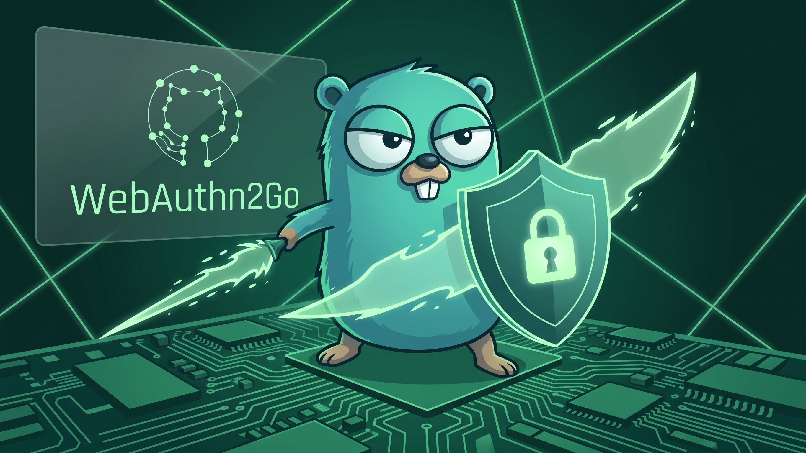

# WebAuthn2Go – Go WebAuthn Server Library



[](https://pkg.go.dev/github.com/MrBoombastic/WebAuthn2Go)

A Go library designed to simplify the server-side implementation of the WebAuthn (FIDO2) protocol for passwordless
authentication.

## Features

* **WebAuthn Server Logic:** Handles core server-side registration and authentication ceremonies.
* **Attestation Support:**
    * Accepts `none`, `indirect`, and `packed` attestation formats.
        * Currently, **skips cryptographic verification** of attestation statements (`AttStmt`), focusing on extracting
          authenticator data (`AuthData`) including AAGUID and Public Key.
* **Assertion Verification:** Validates login assertions including challenge, origin, RP ID, user presence/verification
  flags, and signature.
* **Sign Count Protection:** Checks for increasing sign counts to help prevent replay attacks (requires secure storage
  by the caller).
* **AAGUID Lookup:** Provides a utility to look up authenticator names based on AAGUID.
* **Extension Support:** Basic support for WebAuthn extensions.
* **Configuration:** Simple configuration for Relying Party details.

## Why this library?

This library is designed to be easy to use and integrate into existing Go applications. You don't need to especially
implement custom interfaces or convert your Fiber's `fasthttp.Request` into `http.Request`, like
in https://github.com/go-webauthn/webauthn. There are no other alternatives, except
the https://github.com/egregors/passkey, which is a wrapper around the first one, which additionally can set cookies for
you.

If you want more flexibility or control, and you don't need fancy features, this is the library for You.

## Why NOT this library?

This library is not intended to be a full-fledged WebAuthn implementation. It does not handle attestation verification,
for example. This library is also in early development, so may be not suitable for production use yet.

The library is also not popular. It's possible that this repo has more or less zero stars and has never been reviewed or
used by the third party. So, if you are looking for a battle-tested library, this is not the one.

One more thing – **the code is written with the partial help of AI**. Although the author tried his best to understand
WebAuthn
specification and read various sources, the code may be far from perfect or even insecure. Every line of code has been
read and verified by myself. It wasn't just *do webauthn lib wololo* in ChatGPT. But still, please use it at your own
risk.

Used sources:

- https://www.corbado.com/glossary/attestation and other glossary entries – readable, but sometimes too simple
- https://webauthn.guide/ – general overview
- https://www.w3.org/TR/webauthn/ – THE specification

> [!WARNING]
> This library requires Go 1.25 or newer.

## Example

There is a simple example in the [example](./example) folder.
It uses the `github.com/gofiber/fiber/v2` web framework, but you can use whatever you want.

## Installation

```bash
go get github.com/MrBoombastic/WebAuthn2Go
```

## Configuration

Before using the library, you need to configure your Relying Party (RP) details and other minor settings.

```go
w, err := webauthn.New(&webauthn.Config{
    RPID:             "localhost",                       // Domain name only - must match the domain in your URL
    RPDisplayName:    "WebAuthn2Go Example",             // Display name
    RPOrigins:        []string{"https://yourdomain.com", "https://auth.yourdomain.com"}, // Allowed origins - with protocol and port
    Timeout:          300_000,                           // Milliseconds, 5 minutes
    UserVerification: webauthn.UVPreferred,              // User verification requirement
    Attestation:      webauthn.AttestationIndirect,      // Attestation preference, Indirect gives us AAGUID
    Debug:            true,                              // Enable debug logging
})

w, err := webauthn.New(rpConfig)
if err != nil {
  // Handle configuration error (e.g., missing RPID/Origins)
  log.Fatalf("Failed to initialize WebAuthn: %v", err)
}
```

> [!IMPORTANT]
> * `RPID` **must** be the effective domain of your web application. Browsers enforce this strictly.
> * `RPOrigins` **must** include all origins (scheme + host + port if non-default) from which WebAuthn requests will
    originate. Mismatched origins will cause browser errors.

## Usage Overview

The library provides functions to handle the two main WebAuthn ceremonies: Registration (`Create`) and Authentication (
`Get`).

Please refer to the [example](./example) folder for a complete example (with SQLite3 support) of how to use the library.
The key methods are BeginRegistration, FinishRegistration, BeginLogin, and FinishLogin. You must provide the trusted
ceremony state and transactional persistence callbacks used by the finish methods.

The finish methods require the challenge previously returned by the matching beginning method and retrieved from the
trusted server-side ceremony state. `FinishRegistration` requires a `RegistrationStateConsumer` that atomically consumes
the exact, unexpired registration challenge and persists the verified credential while rejecting duplicate credential
IDs.
`FinishLogin` requires a `LoginStateConsumer` that atomically consumes the exact, unexpired authentication challenge and
compare-and-swaps the signature counter:
`FinishRegistration(registrationData, storedChallenge, commitRegistrationState)` and
`FinishLogin(loginData, storedChallenge, commitLoginState)`.

`LoginData.StoredCredential` must contain the credential ID, public key, signature counter, and owning user handle
loaded
from one trusted database record. The verifier rejects a response credential ID or user handle that does not match it.

> [!IMPORTANT]
> This is a breaking API requirement: completion calls without a trusted ceremony state and the appropriate atomic
> consumer are deliberately rejected.

### Key Caller Responsibilities:

* **User Management:** Maintain your user database.
* **Credential Storage:** The `RegistrationStateConsumer` must securely store the verified `CredentialID`, `PublicKey`,
  and `SignCount` for the owning user while consuming the challenge in the same transaction. Load that record together
  with its owning user handle into `LoginData.StoredCredential` for authentication.
* **Challenge Storage and Consumption:** Securely store each challenge in a trusted, server-side ceremony state, bind it
  to
  the user/session and intended ceremony, give it server-enforced expiry, then pass it to `FinishRegistration` or
  `FinishLogin`. Consumers must reject expired, reused, or wrong-ceremony challenges.
* **Atomic Registration State:** The `RegistrationStateConsumer` must persist the verified credential and consume its
  registration challenge in one transaction. A duplicate credential ID or write failure must roll back challenge
  consumption.
* **Atomic Login State:** The `LoginStateConsumer` must consume the authentication challenge and compare-and-swap the
  signature counter in one transaction. A counter conflict must roll back challenge consumption.

## AAGUID Lookup subpackage

The library includes a subpackage for AAGUID lookup. You are welcome to use it in your own projects. Go to
[example_aaguid](./example_aaguid) for more.

```go
package main

import (
	"fmt"
	"github.com/MrBoombastic/WebAuthn2Go/aaguid"
	"github.com/google/uuid"
)

func main() {
	fmt.Println(aaguid.LookupAuthenticatorUUID(uuid.MustParse("ed042a3a-4b22-4455-bb69-a267b652ae7e")))
	// Security Key NFC - Enterprise Edition (USB-A, USB-C) (Black) FW 5.7
}
```

## Dependencies

* `github.com/google/uuid` additional library used for AAGUID subpackage
* `github.com/go-webauthn/webauthn/protocol/webauthncbor` for CBOR decoding.
* `github.com/go-webauthn/webauthn/protocol/webauthncose` for parsing COSE public keys.

That may sound weird, that alternative to go-webauthn/webauthn uses that library, but actually there is no other choice
if you want to support more than just ES256 algorithm. I'm also assuming that outsourcing "the hard stuff" to more
popular libraries is a safer choice.

## Security Considerations

* **Challenge Management:** Finish methods require the expected server-side challenge and reject mismatches. Typed
  consumers run only after protocol validation and must enforce ceremony type, expiry, and one-time use.
* **Credential Binding:** Authentication verifies the response credential ID and optional user handle against one
  trusted
  `StoredCredential`; discoverable flows must set `RequireUserHandle`.
* **Credential Storage:** Registration succeeds only after the `RegistrationStateConsumer` atomically stores the
  credential together with challenge consumption. Authentication succeeds only after the `LoginStateConsumer`
  atomically advances the matching credential's counter together with challenge consumption.
* **Origin/RP ID Configuration:** `RPOrigins` must be exact HTTPS origins with no path, query, fragment, or user info
  (`http://localhost` is the sole HTTP exception). `RPID` must be a valid registrable domain (or localhost/IP) that
  matches every configured origin.
* **Attestation Verification:** This library currently **does not** perform cryptographic verification of attestation
  statements for `indirect` or `packed` formats.
  It only parses the authenticator data.
  If you require stricter
  verification of authenticator provenance, you would need to implement the specific verification logic for those
  formats.

## Contributing

Contributions are welcome! Please feel free to submit pull requests or open issues.

## License

This project is licensed under the MIT License – see the LICENSE file for details.
